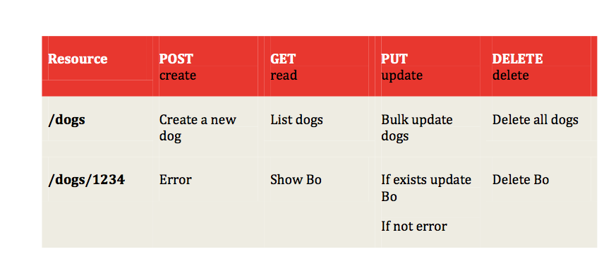

# REST Good practices 

## Useful 

> `Accept` header is a way for a client to specify the media type of the response content it is expecting and `Content-type` is a way to specify the media type of request being sent from the client to the server.

[Google JSON style guide](https://google.github.io/styleguide/jsoncstyleguide.xml)


## Basics
- Use two base URLs per resource.
- Keep verbs out of your base URLs.
- Use HTTP verbs to operate on the collections and elements.




## Plurarl noums and concrete names
We can find popular RESTfull API using both, singular and plural. Since plurar seems to be more intuitive to use, the key thing is to follow only one aproach and to be consistent accross the entiry API.

### Concrete names and better than abstract
Is more intuituve for developers to use and API that expose resources as `videos`, `articles` etc... than `items`, `assets`..


> in resumen, an intuitive API uses plurar rather than singular noums and concrete rather than abstract names.


## Simplify associations - sweep complexity under ?
Witch is handling associations between resources and parameters like states and attributes.


### Associations
Having as base principle that we have two urls peer resource `/dogs` and `/dogs/1234` and that we are using HTTP verbs to operato on the resources. If we want to hadle the association between dogs and its owner, 

`GET /owners/123/dogs`: retrieve the owners' dogs
`POST /owners/123/dogs`: create a dog for a specific owner


Under this consideration we could have many level of associations.. `get the owner's dogs that have been to a certain veterinarian`. The key point is to expose as resource only the primary key of a particular resource. Once we have it we can filter the rest of the resources by querying it. 

`GET /owners/233/dogs?state=running&location=park` In the previous query we are querying the dogs that belong to a particular owner that are running in the park.


## Handling errors
Since for a developer, everyting begind the API is a black box, error become a key piece to provide information and context into how to use the API and what is going on.


### Status codes
Using standar status code aling with the response is a good practice. However there are 70 HTTP status codes and developers usually don't memorize many of then. 

So instead of use all 70 HTTP status code, is better to use a subset of it. 


Tha basic approach is to use 3 status codes:
- 200: everything is ok
- 400: client error
- 500: server error

If we need/want to provide more detail we can add 5 more:
- 201: created
- 304: not modified
- 404: not found
- 401: unauthorized
- 403: forbidden


### Provide information
Provide verbose information in plain text about the error. Is ok to provide different messages (for example, one for the developer and other for the end user) and a link that countains more information about the error.


## Versioning

> Never release an API without a version and make the version mandatory.

- Specify the version number by the prefix `v` and move it all the way to the left in the URL. `v1/dogs`

- Use simple ordinal numbers, don't use notation like `v1.2`.

- Maintain at least one version back.

### Should version and format be in URLs of headers?

Simple rules we follow:
- If it changes the logic you write to handle the response, put it in the URL so you can see it easily.
- If it doesn't change the logic for each response, like OAuth information, put it in the header.


## Pagination and partial response


### Partial response
If needed we can allow field selection in the request. 

`/dogs?fields=name,size,age`

This can also be used to include associanted resources

### Pagination
`/dogs?limit=25&offset=50`


#### Metadata 
One suggestion is to include metadata with each response that is paginated that indicated to the developer the total number of records available.


## Request/responses that do not involve resources

Use verbs not noums. In this case it is allowed to use verbs instead. 
- calculate
- convert
- translate 

`convert?from=EUR&to=CYN&amount=100`


## Supporting multiple formats

The recomendation is to accept more than one format, as much as necesary. 

## Attribute names

- Use JSON as default in responses
-  Follows javascript convention for naming atributes. 
    - Use media capitalization (aka CamelCae)
    - Use uppercase, lowercase depending of the type of object.    


## Tips for search

- For global search use the google format 
`/search?q=fo+abc`

- For scoped search, it is possible to add the scope in the url as a resource
`/owner/1234/dogs?q=fo+abc`


## Authentication
- Use OAuth or OAuth 2.0
- 

## Making requests on your API

### Create an brown dog named A1

`POST /dogs`
`name=A1&furColor=brown`

response
`200 OK`

```
{
    "dog":{
        "id":123,
        "name":"A1",
        "furColor":"brown"
    }
}
```

### Rename A1 to Rovert - Update
`PUT /dogs/123`
`name=Robert`

response
`200 OK`

```
{
    "dog":{
        "id":123,
        "name":"Robert",
        "furColor":"brown"
    }
}
```


### Tell me about a particular dog

`GET /dogs/123`

response 

`200 OK`
```
{
    "dog":{
        "id":123,
        "name": "Robert",
        "furColor": "brown"
    }
}```


### Tell me about all dogs

`GET /dogs`

response 
`200 OK`

```
{
    "dogs":[
        {
            "dog":{
                "id":123,
                ....
            }
        },
        {
            "dog":{
                "id":123,
                ....
            }
        }
    ],
    "metadata":[
        {"totalCount":112, "limint":25, "offset":100}
    ]
}
```

### Delete

`DELETE /dogs/123`

response
`200 OK`
